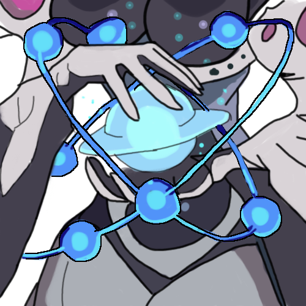

#  TerraTools

An interactive web-based database viewer for *Terra Battle*. 

This editor provides comprehensive access to game assets, character stats, companion drop rates, skills, audio players (BGM/SE), and stage wave board layouts.

---

## Key Features

### 1. Stage Wave Configurations & Interactive Grid Board
* **Visual Grid Board**: Renders an interactive 6x8 board visualizer corresponding to the precise battle grid coordinates of Terra Battle.
* **Wave selection tabs**: Switch between battle waves (`Wave 1`, `Wave 2`, `Wave 3`...) to view changes in enemy layout positions.
* **Interactive Enemy Tokens**: Displays custom tokens for spawned enemies (red glowing pulses for Bosses, orange for normal enemies).
* **Hover tooltips**: Inspect name, level, HP, ATK, and DEF stats instantly.
* **Side-by-side List**: Detailed list of all enemies spawning in the currently active wave.


### 2. Character & Companion DB
* Inspect character and buddy database metadata (HP, ATK, DEF, stats, classes, skills, and rarities).
* Built-in search and filtering.

### 3. Audio Controller Player
* Play case-insensitive BGM soundtracks and Sound Effects (SE) directly through the browser.

### 4. Items & Skills Viewer
* Browse all game items and skills databases with dynamic translation support (English, Japanese, French, German, Spanish, Traditional Chinese).

---

## Project Structure

```text
TerraTools/
├── app.py                      # FastAPI Web Server (main entry point)
├── config.json.example         # Example path configuration template
├── requirements.txt            # Python dependencies (FastAPI, Uvicorn, UnityPy, capstone)
├── local-input/                # User-supplied raw game assets (gitignored)
│   ├── terra-battle-5.5.7-170.apk # Terra Battle v5.5.7 APK
│   └── gdresources/            # Vanilla game client asset bundles (data_u2017/android/...)
├── scripts/                    # Code extraction & decompilation utilities
│   ├── Decompiler.cs           # C# MoonSharp bytecode parser source
│   ├── Decompiler.exe          # Compiled MoonSharp bytecode dumper
│   ├── MoonSharp.Interpreter.dll # Official MoonSharp interpreter library
│   ├── decompile_and_parse_all.py # Automates decompilation and generates StagesLayout.json
│   ├── parse_stages_layout.py  # VM instruction stack-based parser (test script)
│   ├── extract_everything.py   # Extracts and decrypts game database from APK
│   ├── extract_native_stages.py# Extracts native ARM64 stage layouts (Ch 8-42)
│   ├── extract_gamedata.py     # Fallback extractor for raw asset files
│   ├── recompile_everything.py # Recompiles modified assets back into APK
│   ├── search_enemy.py         # Utility to search EnemyData.json NameStrings
│   ├── verify_mapping.py       # Utility to verify metadata enum-to-ID alignment
│   └── test_hash.py            # .NET String.GetHashCode tester
├── frontend/                   # React + Vite frontend source code
│   └── public/
│       └── TerraToolbox.png    # App icon and browser favicon
└── user-data/                  # Extracted assets, databases, and runtime output (gitignored)
    ├── dump.cs                 # Auto-generated C# structure dump (via Il2CppDumper)
    ├── libil2cpp.so            # Extracted ARM64 binary (from APK)
    ├── global-metadata.dat     # Extracted IL2CPP metadata (from APK)
    └── extracted-gamedata/
        └── game_data/
            └── StagesLayout.json # Wave configurations database mapping
```

---

## Local Input Directory (`local-input/`)

The `local-input/` directory is gitignored and acts as the workspace drop-zone for user-provided raw game files, binaries, and asset bundles required by the extraction pipeline and web server.

### Required & Optional Files Breakdown

```text
local-input/
├── terra-battle-5.5.7-170.apk    # [Required] Terra Battle APK
└── gdresources/                   # [Optional / Recommended] Vanilla game asset bundles
    └── data_u2017/
        └── android/
            ├── BG/                # Background graphics asset bundles (.bin)
            ├── BGM/               # Background Music audio bundles (.bin)
            ├── Banner/            # Event banner graphics asset bundles (.bin)
            ├── BuddyImages/       # Companion full artwork bundles (.bin)
            ├── BuddyThumbs/       # Companion thumbnail icon bundles (.bin)
            ├── Illust/            # Character class artwork bundles (.bin)
            ├── Pieces/            # Character grid token sprites (.bin)
            ├── SE/                # Sound Effects audio clip bundles (.bin)
            └── Scenario/          # Scenario DLC & extra battle script bundles (.bin)
```

#### Detailed Description of Contents

1. **`terra-battle-5.5.7-170.apk`** *(Required for Database & Asset Extraction)*
   - **Path**: `local-input/terra-battle-5.5.7-170.apk` (configurable in `config.json`)
   - **Source**: Terra Battle v5.5.7 Android APK file.
   - **Used By**: `scripts/extract_everything.py`, `scripts/decompile_and_parse_all.py`, `scripts/extract_native_stages.py`, `scripts/recompile_everything.py`
   - **Content Extracted**:
     - `global-metadata.dat`: C# `Enemies` enum and string decryption inverse table (at offset `0x601CAD`).
     - `resources.assets` / `data.unity3d`: Game databases (`ChrDatabase`, `BuddyDatabase`, `ItemSet`, `SkillData`, `BattleData`, `StringSet`, `EnemyData`), TextAssets, and `ItemAtlas` sprite graphics.
     - `Chapter1.luac` through `Chapter7.luac`: Lua bytecode stage scripts.
     - `libil2cpp.so`: ARM64 C++ binary for stage layout extraction (Chapters 8–42).

2. **`dump.cs`** *(Auto-generated — Required for Native Stage Layouts — Chapters 8 to 42)*
   - **Path**: `user-data/dump.cs` (configurable in `config.json`)
   - **Source**: Automatically generated by the extraction pipeline (step 7) using [Il2CppDumper](https://github.com/Perfare/Il2CppDumper) on `libil2cpp.so` and `global-metadata.dat` extracted from the APK. Requires `Il2CppDumper` on your system `PATH`.
   - **Used By**: `scripts/extract_native_stages.py` (and step 8 of `scripts/extract_everything.py`).
   - **Content Extracted**: Provides C# structure definitions, method Relative Virtual Addresses (RVAs), and vtable slot mappings needed to disassemble C++ battle generator classes (`Chapter8.$Battle...`).

3. **`gdresources/data_u2017/android/`** *(Optional / Recommended for Media & Live Browsing)*
   - **Path**: `local-input/gdresources/data_u2017/android/`
   - **Source**: Downloaded game client asset cache folder.
   - **Used By**: `scripts/extract_everything.py` (steps 5c & 5d) and `app.py` (`/api/assets` inventory endpoint).
   - **Bundles & Categories**:
     - `BG/`: Stage background images (ENCA-encrypted Unity asset bundles).
     - `BGM/`: Background Music audio clips (`.bin` containing `AudioClip` streams).
     - `Banner/`: UI banners and event graphic asset bundles.
     - `BuddyImages/`: High-resolution companion full artwork asset bundles.
     - `BuddyThumbs/`: Companion thumbnail icon asset bundles.
     - `Illust/`: Character job artwork asset bundles.
     - `Pieces/`: Character battle grid token sprites.
     - `SE/`: Sound Effects audio clip asset bundles.
     - `Scenario/`: Additional scenario DLC files and TextAssets (e.g. `Chapter8.luac`).

---

## Extraction & Decompilation Pipeline

The layout coordinates and battle configuration files are scripted inside compiled MoonSharp Lua chunks (`Chapter*.luac`). We parse these compiled instruction streams to reconstruct the stage coordinates:

1. **Extracting Enum Metadata**:
   We search `global-metadata.dat` inside the game APK to read the C# `Enemies` enum. We resolved that the indices align exactly with the database `ID`s inside `EnemyData.json` (`ID = enum_index + 1`).
2. **Lua Bytecode Decompilation**:
   `Decompiler.exe` loads compiled `.luac` bytecode chunks and hooks into MoonSharp's virtual machine debugger interface, capturing the disassembled instructions stream.
3. **Instruction Stack Parsing**:
   `decompile_and_parse_all.py` performs stack analysis on the bytecode to resolve calls to `CreateEnemy(x, y, enemy_id, vid)`. It replaces string variable references with numeric database IDs and saves coordinates to `StagesLayout.json`.

To run the full extraction and parsing pipeline, place your game APK under `local-input/terra-battle-5.5.7-170.apk` and run:

```bash
# Extract asset databases
python scripts/extract_everything.py

# Decompile chapter scripts and generate wave coordinates database (Chapters 1-7)
python scripts/decompile_and_parse_all.py
```

### Native Stage Extraction (Chapters 8 to 42)

For Chapters 8-42, battle scripts are compiled directly into the ARM64 C++ binary (`libil2cpp.so`). Reconstructing these layouts requires binary disassembly analysis:

#### Prerequisites
1. **`llvm-objdump`**: Must be installed and available on your system `PATH`.
2. **`Il2CppDumper`**: Must be available on your system `PATH`. The extraction pipeline automatically runs it to generate `dump.cs` from the APK's `libil2cpp.so` and `global-metadata.dat`.

#### Configuration
A `config.json` file is located in the root of the project to manage paths (defaults to `./user-data/`):
* `dump_cs_path`: Path to the auto-generated `dump.cs`.
* `apk_path`: Path to your Terra Battle APK.
* `lib_path`: Path to extract `libil2cpp.so` to.
* `objdump_cmd`: Name of the objdump command (defaults to `llvm-objdump`).
* `stages_layout_path`: Output path to update `StagesLayout.json`.

Just rename `config.json.example` to `config.json` and update the paths to match your system configuration.

#### Extraction Execution
To extract native coordinates for Chapters 8+ and merge them into your layout database:
```bash
# Disassemble and extract Chapter 8-42 battle layouts
python scripts/extract_native_stages.py
```


---

## Running the Web Server

1. **Install Dependencies**:
   ```bash
   pip install -r requirements.txt
   ```
2. **Start the server**:
   ```bash
   python app.py
   ```
3. Open [http://127.0.0.1:5000](http://127.0.0.1:5000) in your browser.
